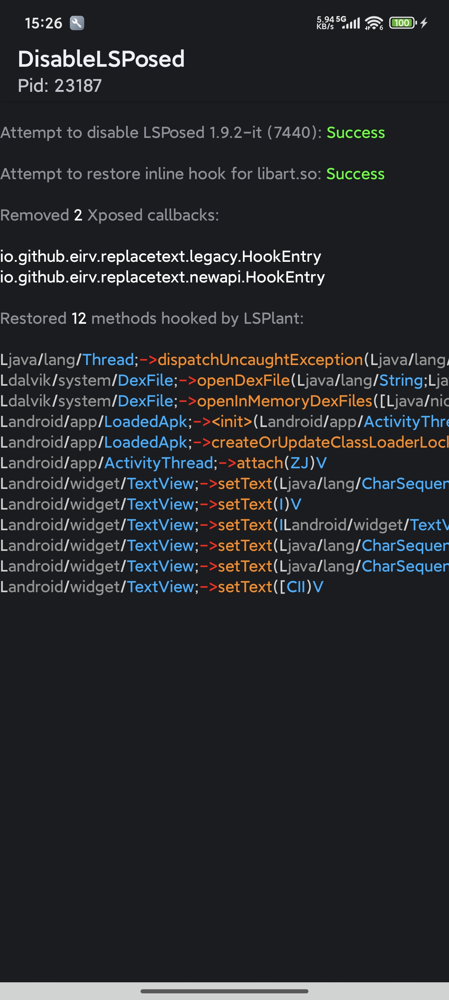

# DisableLSPosed

[**中文**](README_zh.md)

> [!Warning]
> This application is completely unavailable in the latest `LSPosedIT`; you should know [why](https://github.com/eirv?tab=overview&from=2026-01-04&to=2026-01-5) :)

Disable [LSPosed](https://github.com/LSPosed/LSPosed)/[LSPatch](https://github.com/LSPosed/LSPatch) and restore all methods hooked by [LSPlant](https://github.com/LSPosed/LSPlant).

* Prevent `LSPosed` from hooking any method
* Block calls to the `IXposedHookLoadPackage::handleLoadPackage` callback
* Restore methods previously hooked by `LSPosed (LSPlant)`
* Restore inline hooks to `libart.so` in memory

The code was written casually and is for entertainment purposes only.

