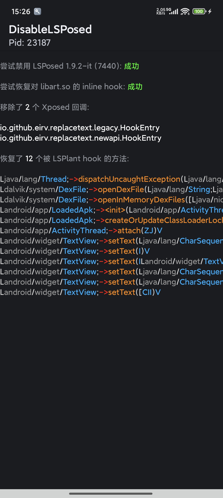

# DisableLSPosed

[**English**](README.md)

让 [LSPosed](https://github.com/LSPosed/LSPosed)/[LSPatch](https://github.com/LSPosed/LSPatch) 失效并恢复所有被 [LSPlant](https://github.com/LSPosed/LSPlant) hook 的方法

* 使 `LSPosed` 无法 hook 任何方法
* 阻止调用 `IXposedHookLoadPackage::handleLoadPackage` 回调
* 恢复先前被 `LSPosed (LSPlant)` hook 的方法
* 恢复内存中对于 `libart.so` 的 inline hook

代码我乱写的, 仅供娱乐

